# NBA_EDA_Project
by Delabriliano Ismail and Quentin Belaud

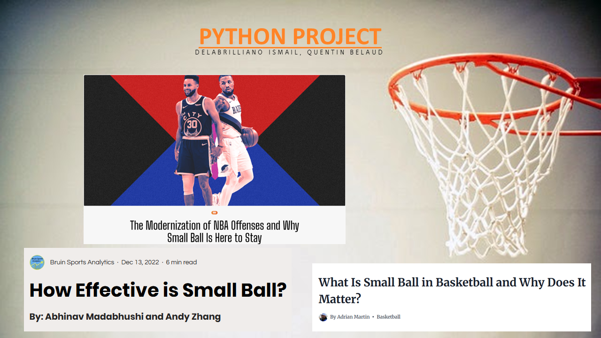

## Description
A data analytics project exploring NBA shot distribution trends from 2010–11 to 2023–24. Includes data cleaning (pandas, regex, unidecode) and visualization (seaborn, matplotlib) to highlight the shift from midrange shots to three-point dominance. Data sourced from public GitHub repositories and Kaggle.

This project was developed as the final project for the Python Bootcamp at KEDGE Business School, as part of the MSc in Data Analytics for Business program.

## Data Sources
- [NBA Regular Season Box Score](https://github.com/NocturneBear/NBA-Data-2010-2024) — NBA regular season game statistics dataset used for performance metrics.
- [NBA Shot Location Data](https://github.com/DomSamangy/NBA_Shots_04_25) — Shooting dataset used for shot distribution analysis.
- [NBA Player Stats Dataset](https://www.kaggle.com/datasets/bryanchungweather/nba-player-stats-dataset-for-the-2023-2024) — Used as a supplementary dataset for Position, Height, and Weight.

## Results
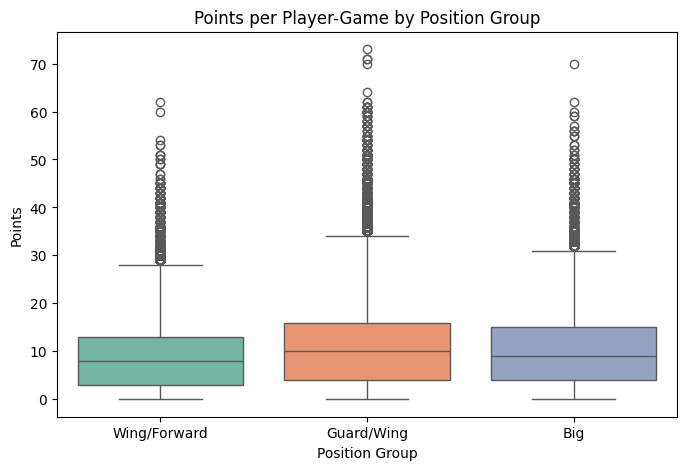

Across all seasons, the distribution of points per player-game appears similar across position groups, with medians around 10 points. This suggests that on a per-game basis, no single position group dominates scoring outright.

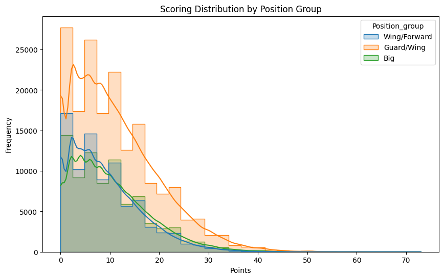

When comparing distributions, Guards/Wings are more likely to contribute modest scoring performances, while Bigs show a more balanced spread. This reflects the increasing reliance on perimeter players for consistent offensive contributions.

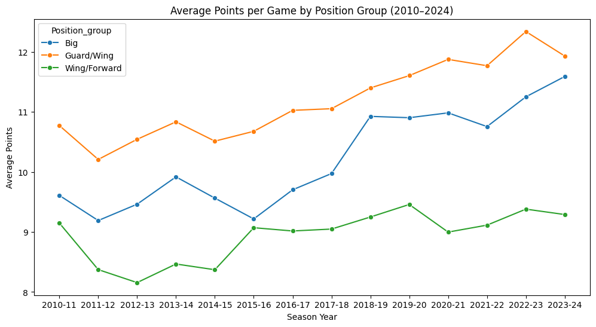

Over time, Guards/Wings have steadily increased their average scoring load, while Bigs and Wing/Forwards have remained flat. This trend aligns with the rise of small-ball strategies, where perimeter players drive offensive production.

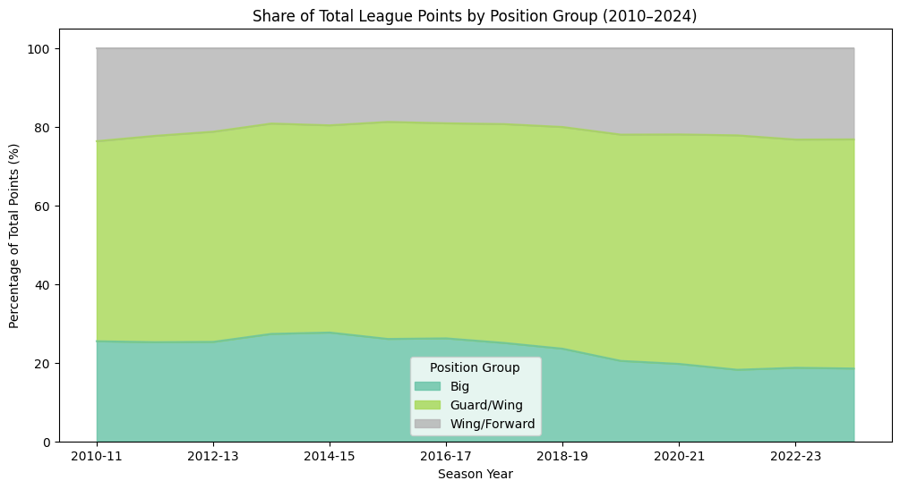

To quantify the shift toward small-ball, We calculated the percentage of total league points scored by each position group per season. The results show a clear upward trend for Guards/Wings, who now account for a significantly larger share of scoring compared to 2010. Meanwhile, Bigs’ contribution has declined, reflecting the league’s transition toward perimeter-oriented play.

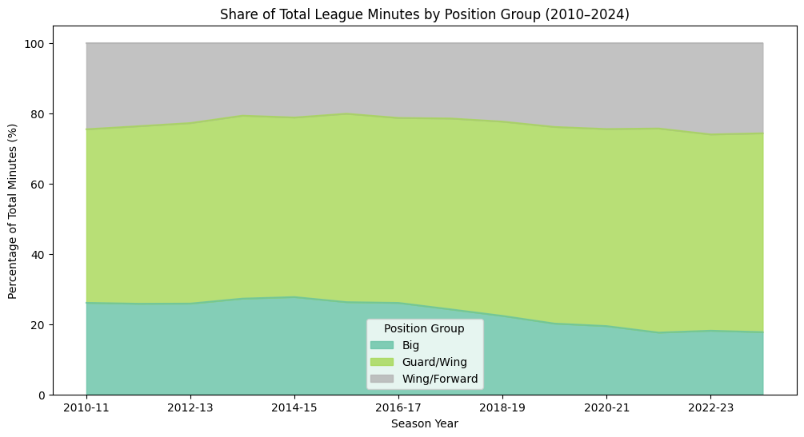

In addition to scoring share, we also examined the distribution of playing time across position groups. By calculating each group’s share of total league minutes per season, we can see how coaches allocate floor time. The results show that Guards/Wings have steadily increased their share of minutes, while Bigs have declined. This reinforces the scoring trend and provides further evidence of the league’s shift toward small-ball lineups.

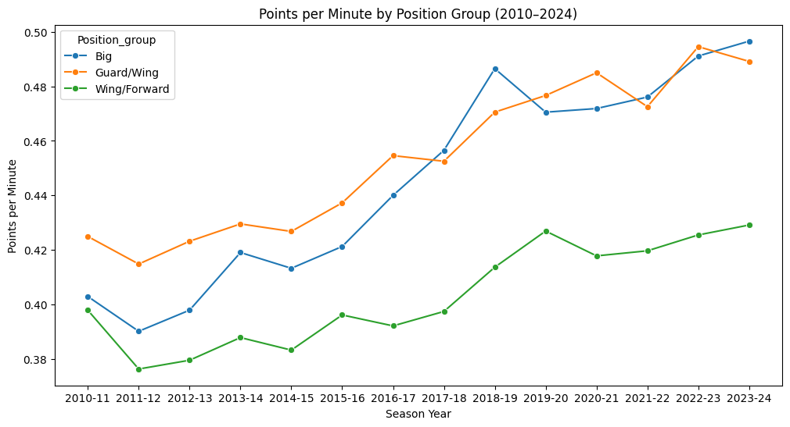

Bigs remain the most efficient scorers on a per-minute basis, but their reduced playing time and role in modern offenses mean that Guards/Wings now dominate total scoring output. This reflects the strategic tradeoff of small-ball: teams prioritize spacing, pace, and versatility over pure efficiency at the rim.

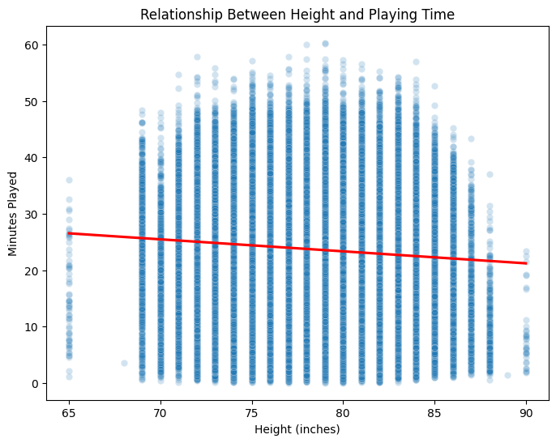

The scatterplot reveals a weak but negative relationship between height and playing time, suggesting that taller players are not systematically favored in modern rotations.

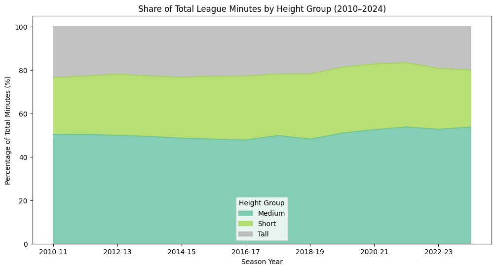

When looking at league‑wide minutes share, medium‑sized players dominate, while shorter players have gained ground. Taller players, by contrast, have not increased their share, reinforcing the shift away from traditional big‑man lineups.

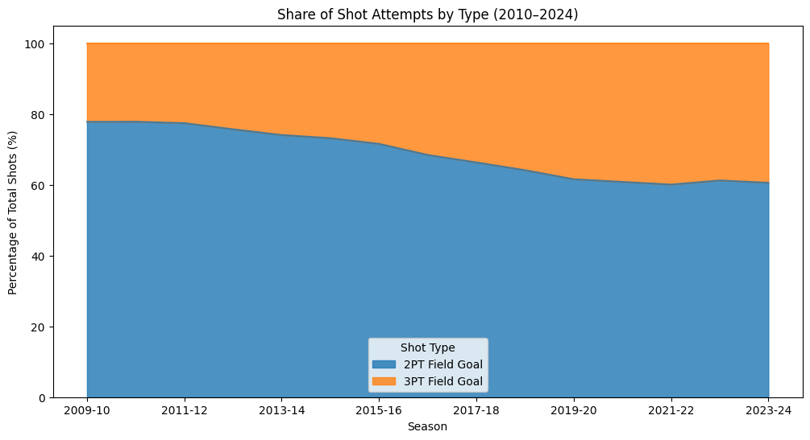

The stacked area chart illustrates how shot selection in the NBA has shifted between 2010 and 2024. At the start of the period, the majority of attempts were 2‑point field goals, but their share has steadily declined over time. In contrast, 3‑point field goals have grown from a relatively small portion of total attempts into a central feature of league offenses. This clear crossover highlights a structural change in strategy: teams are increasingly prioritizing perimeter shooting over midrange and interior attempts, laying the foundation for the rise of small‑ball basketball.

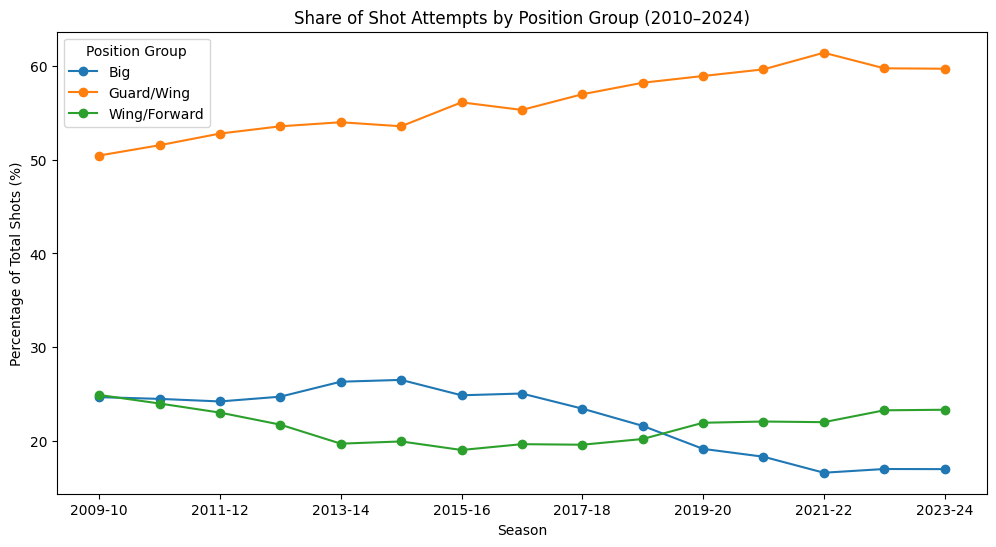

The distribution of shot attempts across position groups highlights a clear structural shift in offensive responsibility. Since 2010, Guards/Wings have steadily increased their share of total shots, rising from around 50% to around 60% of all attempts. In contrast, Bigs peaked in the mid‑2010s but have since declined, while Wings/Forwards have stabilized near 25%. This trend underscores the growing centrality of perimeter‑oriented players in modern offenses, consistent with the league‑wide rise in three‑point shooting.

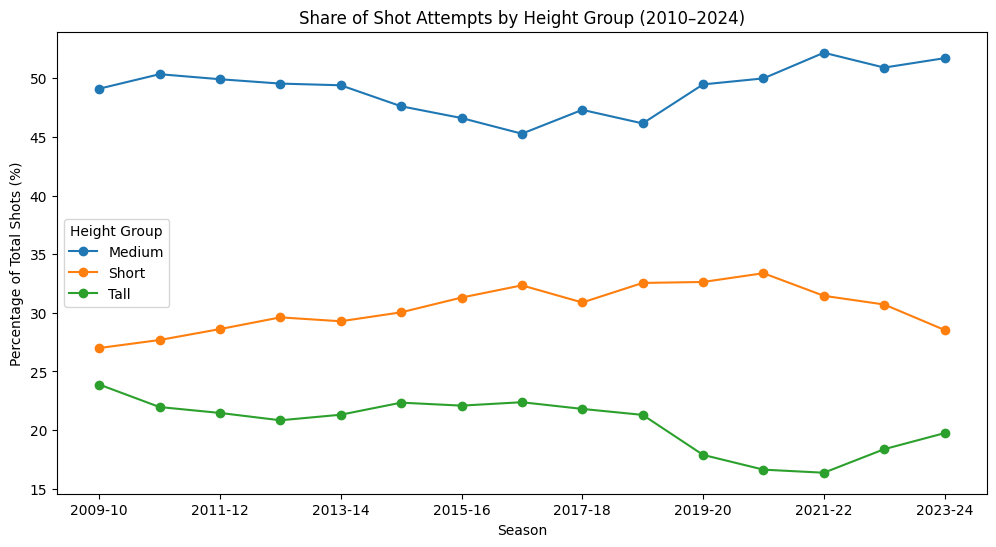

When the same analysis is viewed through the lens of player size, the picture becomes even more striking. Medium‑height players dominate shot creation, accounting for close to half of all attempts throughout the period and surpassing the 50 percent mark in recent seasons. Short players, who once contributed close to 30 percent of attempts, have gradually declined to around 28 percent, while tall players consistently represent the smallest share of shots. Taken together, these results suggest that the shift toward perimeter play is not simply about shorter players taking more shots, but rather about the rise of medium‑sized, versatile guards and wings who can both handle the ball and stretch the floor. Tall players remain involved, but their role has narrowed to rim finishing and selective perimeter shooting rather than high‑volume creation.

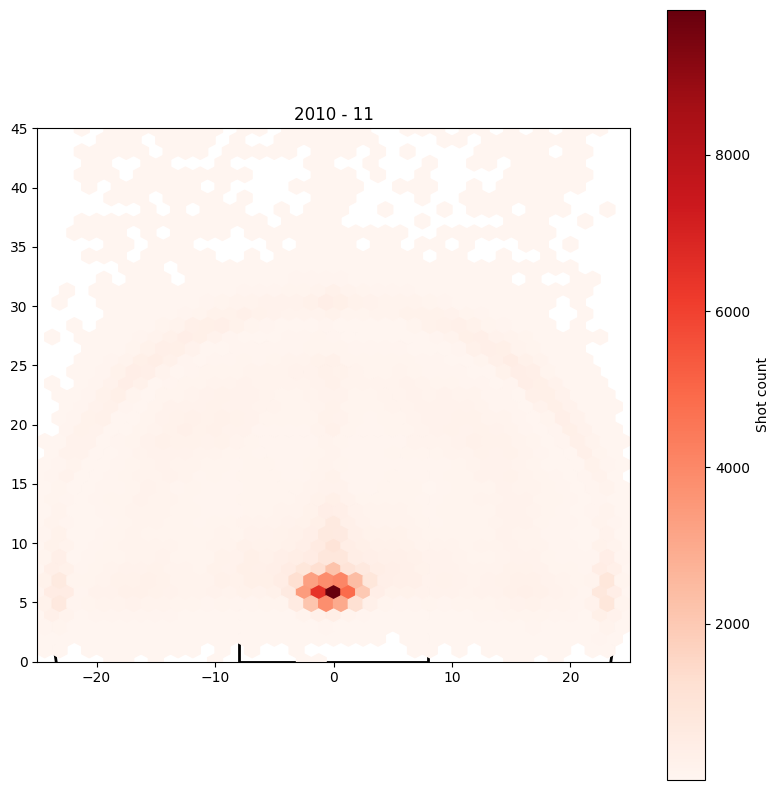

During this era, shot attempts were heavily concentrated near the basket, reflecting the dominance of post play and midrange jumpers. The midrange area (10–20 feet) also showed significant activity, aligning with the offensive strategies of the time. While three‑point attempts were present, they were relatively modest, with noticeably less density along the arc compared to modern play.

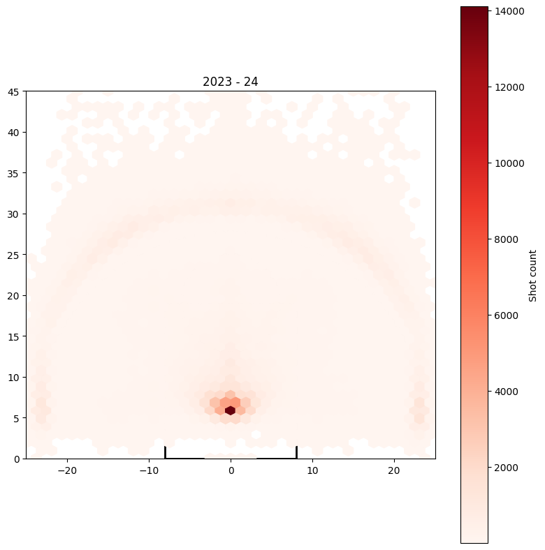

In the modern era, the paint remains a high‑volume scoring zone, but the midrange has thinned out considerably compared to earlier seasons. There is a dramatic increase in three‑point attempts, particularly from the corners and above the break, highlighting the league’s shift toward perimeter‑oriented play. Overall shot volume is also much higher, with totals nearly doubling (color scale extending to ~14,000 versus ~8,000 in 2010–11), reflecting the faster pace of play and increased number of possessions in today’s game.

## Conclusions

**Scoring remains highly concentrated**​

- Few players carry most of the offensive load. Many contribute to non-scoring
roles​

**Positional dynamics have shifted**​
- Guards and Wings dominate in scoring and minutes​
- Bigs have declined in percentage of total points, total minutes, and total shots.
Height trends confirm the shift​

**Shot selection has been transforming​**
- Decline in midrange and interior attempts​
- 3PT shooting has greatly increased​

**Small ball is making the NBA evolve​**
- Not just about size. It’s about role, efficiency, and philosophy.

## Acknowledgments
This project was completed as the final project for the Python Bootcamp at KEDGE Business School, MSc Data Analytics for Business.
